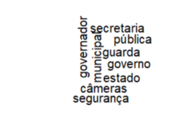

Olga Caldas, Doutoranda em Ciência Política (IESP/UERJ)

Uma das grandes questões da democracia é a congruência entre as preferências dos eleitores e dos políticos. O autor Anthony Downs (1957), em sua teoria econômica da democracia argumenta que os políticos são agentes racionais que buscam maximizar suas chances de eleição, fazendo política para se eleger, não ao contrário. Por isso, eles se orientam pelas preferências dos eleitores para formular seus planos de governo. Neste texto, busco verificar em que medida há congruência entre as preferências do eleitorado carioca em relação a áreas de políticas públicas e os pontos destacados no primeiro debate entre candidatos. Em sua mais recente pesquisa publicada, o Datafolha apresentou algumas das principais demandas do eleitorado carioca para com o futuro prefeito da cidade do Rio de Janeiro. No entanto, será que o que dizem os candidatos à prefeitura da cidade está alinhado com as prioridades dos eleitores?

Para tanto, foi realizada uma análise baseada no primeiro debate entre candidatos à prefeitura do Rio de Janeiro vis à vis as prioridades dos eleitores. Segundo a pesquisa publicada pelo DataFolha no dia 23 de agosto, o tema prioritário para o eleitorado é a segurança (31%), sendo o mais citado entre todas as faixas sociodemográficas. Ademais, 70% do eleitorado declarou se sentir muito mais inseguro do que há um ano atrás. Além da segurança, tópicos como: educação (19%), saúde (17%) e emprego (7%), precisam da atenção do futuro prefeito, conforme os eleitores cariocas.

Para analisar o foco do discurso dos candidatos no debate foi realizada a transcrição do debate e desconsideradas as stop words, palavras que não imputam significados substantivos como preposições, artigos, conjunções e outros. Nessa primeira análise, o nome dos próprios candidatos também foi desconsiderado, levando em consideração que os mesmos são nominalmente citados inúmeras vezes no debate. Assim, ao observar os termos relevantes mais mencionados tem-se um match entre preferências eleitorais e discurso dos candidatos, sendo a palavra mais citada: segurança (48 vezes), a medalha de prata dentre as palavras mais citadas ficou com saúde (46 vezes). No entanto, para a população carioca à atenção a educação ocupa a segunda posição, pauta esta que foi citada 28 vezes pelos candidatos à prefeitos, ocupando a 6° posição no ranking das mais citadas. O emprego, correspondente à prioridade de 7% dos eleitores, foi citada apenas 3 vezes, nem entrando no ranking das 10 mais citadas.

Palavras como “Lula” e “Bolsonaro” também estão entre as mais mencionadas, respectivamente 27 e 30 vezes. O que pode demonstrar também a estratégia dos candidatos em estarem associados (ou não) a esses atores políticos, visto que 56% não votariam de jeito nenhum em candidatos associados ao ex-presidente Jair Bolsonaro e 47% não votariam de jeito nenhum em candidatos associados ao presidente Lula.

Além da contagem de palavras, também foi utilizada a modelagem de tópicos nesta análise. Os tópicos possuem um grupo de palavras correlacionadas, que aparecem juntas no texto analisado, elas apontam um tema específico. Ao observar os tópicos gerados pelo debate entre os candidatos, por exemplo, é possível ver o tópico relacionado à segurança. Neste, as principais palavras foram: governador, secretaria, pública, guarda, governo, estado, câmeras, segurança, como demonstrado a seguir:

Dessa maneira, é possível observar que candidatos estão atentos às preocupações de segurança, apesar do tema ter relação mais direta com o governo do Estado e uma das propostas mais mencionadas sobre o tema ser a liberação do uso de arma de fogo para guardas municipais, medida impopular entre os eleitores, reprovada por 61% dos eleitores, de acordo com a pesquisa do DataFolha. Também é possível notar que há certo espaço entre o discurso do debate e as prioridades manifestadas pelos eleitores em áreas como educação e emprego. Portanto, é interessante perceber que apesar da segurança estar alinhada à expectativa do eleitor em ouvir propostas sobre o assunto e a correspondência dos candidatos, existem possibilidades de explorar mais sobre o tema e ainda há caminhos e possibilidades em outros temas como educação e emprego para percorrer, conquistando eleitores e buscando atender às suas necessidades e demandas.